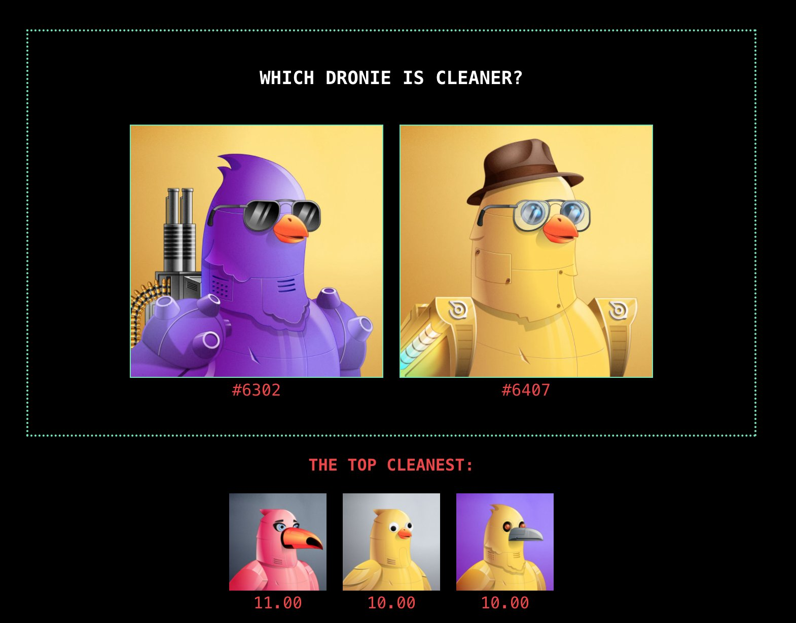

# Clean Dronies - Community-Sourced NFT Rarity Tool

A Laravel-based web application that enables community voting on NFT attributes, originally built for the [Dronies NFT collection](https://www.droniesnft.com/). This tool was created to help identify "clean" NFTs - those with minimal design attributes that became unexpectedly valuable in the community.



## The Story

Clean Dronies was born from an interesting phenomenon in the NFT space where sometimes the "cleaner" (less cluttered) NFTs become more desirable than their rarer counterparts. While traditional rarity tools focus on attribute scarcity, this project explores the concept of "clean" design - where simplicity and minimalism create value.

The project started with the "Clean Gang" - a group of Dronies NFT holders who identified and defined what makes a Dronie "clean". Their scoring system, defined in `clean-gang-rules.json`, became the foundation for this community-driven ranking tool.

## Architecture

### Core Components

1. **Clean Gang Rules Engine**
   - Implemented in `CleanMeter` class
   - Calculates clean scores based on attribute combinations
   - Categorizes Dronies from "NOT CLEAN" to "TRUE CLEAN"
   - Provides baseline for community voting

2. **Voting System**
   - Tournament-style voting interface
   - Real-time leaderboard updates
   - Win percentage tracking
   - Caching for performance

3. **Data Collection**
   - Automated scraping from HowRare.is
   - Comprehensive attribute tracking
   - Market data integration
   - Regular data updates

### Data Flow

1. **Initial Setup**
   ```bash
   # Scrape NFT data
   php artisan scrape:dronies
   
   # Initialize voting system
   php artisan votes:translate-score
   
   # Compile initial rankings
   php artisan dronies:compile-top
   ```

2. **Regular Maintenance**
   - Daily scraping of new data
   - Weekly vote compilation
   - Monthly clean score recalculation

3. **Performance Optimization**
   - Cached leaderboards
   - Indexed database queries
   - Optimized asset loading

### Key Features

- Tournament-style voting system
- Real-time leaderboard
- NFT search functionality
- Community-driven rankings
- Clean score calculation
- Win percentage tracking
- Caching for performance optimization

## Getting Started

For detailed setup instructions and development guidelines, see our [Quick Start Guide](QUICKSTART.md).

## License

This project is open source and available under the [MIT License](LICENSE.md). While you are free to use and modify this code for any purpose, we kindly request that you include attribution to Jamie Howard (@jamiehoward) in any derivative works or distributions.
